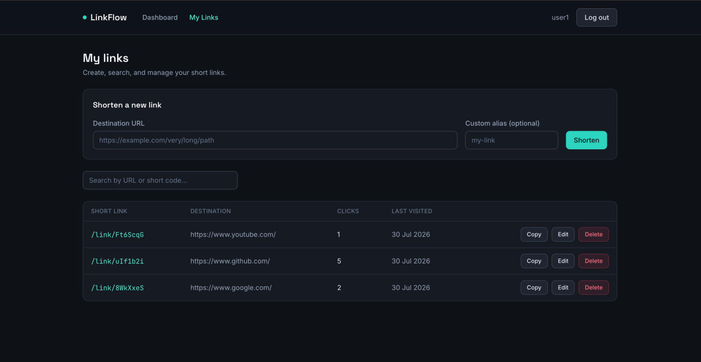

# LinkFlow

A production-ready full-stack URL shortener built with **React**, **FastAPI**, and **PostgreSQL**. The application features JWT authentication, custom aliases, click analytics, and a responsive dashboard. It is fully containerized with Docker and deployed on **Vercel**, **Render**, and **Neon PostgreSQL**.

**Stack:** React + TypeScript + Vite + Tailwind CSS (frontend) · FastAPI +
SQLAlchemy + PostgreSQL + Alembic (backend) · Docker Compose

## 🚀 Live Demo

- **Frontend:** https://linkflow-opal.vercel.app
- **Backend API:** https://linkflow-4dck.onrender.com
- **API Docs:** https://linkflow-4dck.onrender.com/docs

---

## Table of Contents

- [Features](#features)
- [Architecture](#architecture)
- [Project Structure](#project-structure)
- [Getting Started](#getting-started)
  - [Option A: Docker Compose (recommended)](#option-a-docker-compose-recommended)
  - [Option B: Manual local setup](#option-b-manual-local-setup)
- [Environment Variables](#environment-variables)
- [API Documentation](#api-documentation)
- [Database Schema](#database-schema)
- [Screenshots](#screenshots)
- [Design Decisions](#design-decisions)
- [Future Improvements](#future-improvements)

---

## Features

- Email/password registration and login with JWT authentication
- Create shortened URLs with an optional custom alias
- View, search, edit, and delete your own links
- Public redirect endpoint (`/link/{shortCode}`) with click tracking
- Dashboard with aggregated statistics (total links, active links, total clicks)
- Per-link analytics: total clicks, created date, last visited
- Auto-generated Swagger/OpenAPI documentation
- - Containerized using Docker and Docker Compose

## Architecture

```
┌─────────────┐        HTTPS/JSON        ┌──────────────┐       SQL       ┌────────────┐
│   React     │  ───────────────────▶   │   FastAPI     │  ───────────▶  │ PostgreSQL │
│  (Vite SPA) │  ◀───────────────────   │   Backend     │  ◀───────────  │            │
└─────────────┘                          └──────────────┘                 └────────────┘
```

**Backend** follows a layered structure so each piece has exactly one job:

```
routers    → HTTP layer only: parse requests, call services, map errors to status codes
services   → Business logic: auth rules, URL creation, click tracking, ownership checks
models     → SQLAlchemy ORM models (the DB schema)
schemas    → Pydantic models (the public API contract)
database   → Engine/session setup
core       → Config, JWT, password hashing, shared dependencies, exceptions
utils      → Small stateless helpers (e.g. short-code generation)
```

Routers never touch the database directly, and services never know about
HTTP status codes — that separation keeps business logic testable and easy
to reason about in isolation.

**Frontend** mirrors the same idea:

```
services  → Axios calls, grouped by resource (authService, urlService)
hooks     → Data-fetching/state logic (useAuth, useUrls) - components never call Axios directly
contexts  → AuthContext (JWT + current user state)
pages     → Route-level views
components→ Reusable, presentational UI pieces
types     → Shared TypeScript interfaces, mirroring the backend's Pydantic schemas
```

## Project Structure

```
linkflow/
├── backend/
│   ├── routers/       auth.py, urls.py, redirect.py, dashboard.py
│   ├── services/      auth_service.py, url_service.py
│   ├── models/        user.py, url.py
│   ├── schemas/       user.py, url.py, dashboard.py
│   ├── database/      session.py
│   ├── core/          config.py, security.py, dependencies.py, exceptions.py
│   ├── utils/         short_code.py
│   ├── alembic/       migrations
│   ├── tests/         conftest.py, test_auth.py, test_urls.py, test_redirect.py
│   ├── main.py
│   ├── requirements.txt
│   ├── requirements-dev.txt
│   ├── pytest.ini
│   ├── Dockerfile
│   └── .env.example
├── frontend/
│   └── src/
│       ├── components/
│       ├── pages/
│       ├── services/
│       ├── hooks/
│       ├── contexts/
│       └── types/
│   ├── Dockerfile
│   └── .env.example
├── docker-compose.yml
├── .env.example
└── README.md
```

## Getting Started

## Deployment

| Component | Platform        |
| --------- | --------------- |
| Frontend  | Vercel          |
| Backend   | Render          |
| Database  | Neon PostgreSQL |

The application is deployed as a distributed full-stack system:

- React frontend hosted on Vercel
- FastAPI backend hosted on Render
- PostgreSQL database hosted on Neon

### Option A: Docker Compose (recommended)

Requires Docker and Docker Compose.

```bash
git clone <https://github.com/Aarshi1508/LinkFlow>
cd linkflow
cp .env.example .env
# edit .env and set a real JWT_SECRET_KEY before running in anything but local dev
docker compose up --build
```

This starts three services:

| Service  | URL                        |
| -------- | -------------------------- |
| Frontend | http://localhost:5173      |
| Backend  | http://localhost:8000      |
| API docs | http://localhost:8000/docs |
| Postgres | localhost:5432             |

Migrations run automatically on backend startup — no manual step needed.

### Option B: Manual local setup

**Backend**

```bash
cd backend
python -m venv venv
source venv/bin/activate   # Windows: venv\Scripts\activate
pip install -r requirements.txt

cp .env.example .env
# edit .env - set DATABASE_URL to a Postgres instance you have running locally

alembic upgrade head
uvicorn main:app --reload
```

**Frontend**

```bash
cd frontend
npm install
cp .env.example .env
npm run dev
```

## Environment Variables

**Root `.env`** (used by `docker-compose.yml`):

| Variable                      | Description                                                     |
| ----------------------------- | --------------------------------------------------------------- |
| `POSTGRES_USER`               | Postgres username                                               |
| `POSTGRES_PASSWORD`           | Postgres password                                               |
| `POSTGRES_DB`                 | Postgres database name                                          |
| `JWT_SECRET_KEY`              | Secret used to sign JWTs - generate with `openssl rand -hex 32` |
| `JWT_ALGORITHM`               | JWT signing algorithm (default `HS256`)                         |
| `ACCESS_TOKEN_EXPIRE_MINUTES` | JWT expiry in minutes                                           |
| `BASE_URL`                    | Public base URL of the backend                                  |
| `CORS_ORIGINS`                | Comma-separated list of allowed frontend origins                |
| `VITE_API_URL`                | Backend URL the frontend calls (browser-facing)                 |

**`backend/.env`** and **`frontend/.env`** — see each folder's `.env.example`
for the standalone (non-Docker) equivalents.

## API Documentation

Interactive Swagger docs are auto-generated by FastAPI at `/docs` (and
ReDoc at `/redoc`) once the backend is running.

| Method | Endpoint            | Auth required | Description                                         |
| ------ | ------------------- | :-----------: | --------------------------------------------------- |
| POST   | `/register`         |       –       | Create a new user account                           |
| POST   | `/login`            |       –       | Exchange credentials for a JWT                      |
| GET    | `/profile`          |      ✅       | Get the current user's profile                      |
| POST   | `/shorten`          |      ✅       | Create a shortened URL                              |
| GET    | `/urls`             |      ✅       | List the current user's URLs (`?search=`)           |
| GET    | `/urls/{id}`        |      ✅       | Get one URL's details/analytics                     |
| PUT    | `/urls/{id}`        |      ✅       | Update a URL's destination or alias                 |
| DELETE | `/urls/{id}`        |      ✅       | Delete a URL                                        |
| GET    | `/dashboard/stats`  |      ✅       | Aggregate stats: total/active links, total clicks   |
| GET    | `/link/{shortCode}` |       –       | Public redirect to the original URL (tracks clicks) |
| GET    | `/health`           |       –       | Liveness check                                      |

Authenticated requests require an `Authorization: Bearer <token>` header,
obtained from `POST /login`.

## Database Schema

**users**

| Column        | Type      | Notes                                  |
| ------------- | --------- | -------------------------------------- |
| id            | integer   | primary key                            |
| name          | string    |                                        |
| email         | string    | unique, indexed                        |
| password_hash | string    | bcrypt hash, never returned by the API |
| created_at    | timestamp |                                        |

**urls**

| Column       | Type      | Notes                                       |
| ------------ | --------- | ------------------------------------------- |
| id           | integer   | primary key                                 |
| user_id      | integer   | foreign key → users.id, `ON DELETE CASCADE` |
| original_url | string    |                                             |
| short_code   | string    | unique, indexed                             |
| total_clicks | integer   | default 0                                   |
| last_visited | timestamp | nullable                                    |
| created_at   | timestamp |                                             |

## Testing

The backend has a small, focused pytest suite covering business logic:
registration/login rules (including bcrypt's 72-byte password limit being
handled as a clean validation error), JWT-protected access, URL ownership
enforcement, and redirect/click-tracking behavior.

**Setup:**

```bash
cd backend
python -m venv venv
source venv/bin/activate   # Windows: venv\Scripts\activate
pip install -r requirements-dev.txt
```

**Run the tests:**

```bash
pytest
```

```bash
pytest -v                      # verbose, one line per test
pytest tests/test_urls.py      # run a single file
pytest -k "duplicate"          # run tests matching a keyword
```

**How it's isolated:** tests run against an in-memory SQLite database, not
your real Postgres instance — no Docker or running database is required.
Every test gets a freshly created schema (`conftest.py`'s `_fresh_database`
fixture drops and recreates all tables before/after each test), so tests
are fully isolated and can run in any order without leaking state between
them. `client`, `auth_headers`, and `other_user_auth_headers` fixtures give
each test a ready-to-use API client and JWTs for two distinct users, which
is what makes the ownership tests (`test_cannot_edit_another_users_url`,
etc.) straightforward to write.

## Screenshots

### Login


### Dashboard


### My Links



## Design Decisions

- **Layered Architecture:** Business logic is isolated in service classes, while routers handle only HTTP requests and responses.
- **Framework-Agnostic Services:** Services raise domain-specific exceptions instead of HTTP exceptions, keeping business logic independent and easier to test.
- **Centralized Authorization:** URL ownership checks are handled in one place to avoid duplicated authorization logic.
- **Secure Short Codes:** Short codes are generated using Python's `secrets` module for better unpredictability.
- **Documented API:** FastAPI automatically generates interactive Swagger/OpenAPI documentation.

## Future Improvements

- Rate limiting on `/shorten` and `/login`
- Refresh tokens / token revocation
- Per-click event log (timestamps, referrers) instead of a single aggregate counter
- Pagination on `GET /urls`
- QR code generation for each short link
- Email verification on registration
