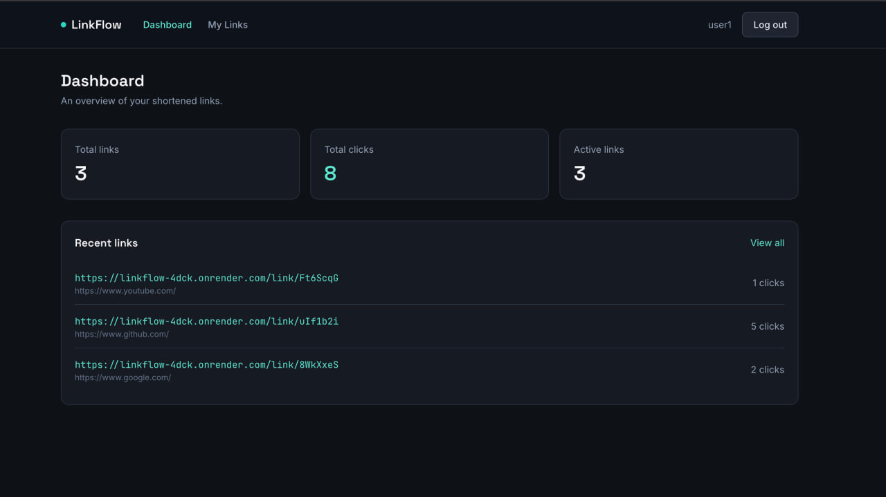

# LinkFlow

A full-stack URL shortener built as a portfolio project to demonstrate clean,
layered architecture on both the backend and frontend — JWT authentication,
custom aliases, per-link analytics, and a dashboard, all containerized with
Docker.

**Stack:** React + TypeScript + Vite + Tailwind CSS (frontend) · FastAPI +
SQLAlchemy + PostgreSQL + Alembic (backend) · Docker Compose

---

## Table of Contents

- [Features](#features)
- [Architecture](#architecture)
- [Project Structure](#project-structure)
- [Getting Started](#getting-started)
  - [Option A: Docker Compose (recommended)](#option-a-docker-compose-recommended)
  - [Option B: Manual local setup](#option-b-manual-local-setup)
- [Environment Variables](#environment-variables)
- [API Documentation](#api-documentation)
- [Database Schema](#database-schema)
- [Screenshots](#screenshots)
- [Design Decisions](#design-decisions)
- [Troubleshooting](#troubleshooting)
- [Future Improvements](#future-improvements)

---

## Features

- Email/password registration and login with JWT authentication
- Create shortened URLs with an optional custom alias
- View, search, edit, and delete your own links
- Public redirect endpoint (`/link/{shortCode}`) with click tracking
- Dashboard: total links, total clicks, active links
- Per-link analytics: total clicks, created date, last visited
- Auto-generated Swagger/OpenAPI documentation
- Fully containerized with Docker Compose (Postgres + backend + frontend)

## Architecture

```
┌─────────────┐        HTTPS/JSON        ┌──────────────┐       SQL       ┌────────────┐
│   React     │  ───────────────────▶   │   FastAPI     │  ───────────▶  │ PostgreSQL │
│  (Vite SPA) │  ◀───────────────────   │   Backend     │  ◀───────────  │            │
└─────────────┘                          └──────────────┘                 └────────────┘
```

**Backend** follows a layered structure so each piece has exactly one job:

```
routers    → HTTP layer only: parse requests, call services, map errors to status codes
services   → Business logic: auth rules, URL creation, click tracking, ownership checks
models     → SQLAlchemy ORM models (the DB schema)
schemas    → Pydantic models (the public API contract)
database   → Engine/session setup
core       → Config, JWT, password hashing, shared dependencies, exceptions
utils      → Small stateless helpers (e.g. short-code generation)
```

Routers never touch the database directly, and services never know about
HTTP status codes — that separation keeps business logic testable and easy
to reason about in isolation.

**Frontend** mirrors the same idea:

```
services  → Axios calls, grouped by resource (authService, urlService)
hooks     → Data-fetching/state logic (useAuth, useUrls) - components never call Axios directly
contexts  → AuthContext (JWT + current user state)
pages     → Route-level views
components→ Reusable, presentational UI pieces
types     → Shared TypeScript interfaces, mirroring the backend's Pydantic schemas
```

## Project Structure

```
linkflow/
├── backend/
│   ├── routers/       auth.py, urls.py, redirect.py, dashboard.py
│   ├── services/      auth_service.py, url_service.py
│   ├── models/        user.py, url.py
│   ├── schemas/       user.py, url.py, dashboard.py
│   ├── database/      session.py
│   ├── core/          config.py, security.py, dependencies.py, exceptions.py
│   ├── utils/         short_code.py
│   ├── alembic/       migrations
│   ├── tests/         conftest.py, test_auth.py, test_urls.py, test_redirect.py
│   ├── main.py
│   ├── requirements.txt
│   ├── requirements-dev.txt
│   ├── pytest.ini
│   ├── Dockerfile
│   └── .env.example
├── frontend/
│   └── src/
│       ├── components/
│       ├── pages/
│       ├── services/
│       ├── hooks/
│       ├── contexts/
│       └── types/
│   ├── Dockerfile
│   └── .env.example
├── docker-compose.yml
├── .env.example
└── README.md
```

## Getting Started

### Option A: Docker Compose (recommended)

Requires Docker and Docker Compose.

```bash
git clone <your-repo-url>
cd linkflow
cp .env.example .env
# edit .env and set a real JWT_SECRET_KEY before running in anything but local dev
docker compose up --build
```

This starts three services:

| Service  | URL                          |
|----------|-------------------------------|
| Frontend | http://localhost:5173         |
| Backend  | http://localhost:8000         |
| API docs | http://localhost:8000/docs    |
| Postgres | localhost:5432                |

Migrations run automatically on backend startup — no manual step needed.

### Option B: Manual local setup

**Backend**

```bash
cd backend
python -m venv venv
source venv/bin/activate   # Windows: venv\Scripts\activate
pip install -r requirements.txt

cp .env.example .env
# edit .env - set DATABASE_URL to a Postgres instance you have running locally

alembic upgrade head
uvicorn main:app --reload
```

**Frontend**

```bash
cd frontend
npm install
cp .env.example .env
npm run dev
```

## Environment Variables

**Root `.env`** (used by `docker-compose.yml`):

| Variable                      | Description                                    |
|--------------------------------|------------------------------------------------|
| `POSTGRES_USER`                | Postgres username                              |
| `POSTGRES_PASSWORD`            | Postgres password                              |
| `POSTGRES_DB`                  | Postgres database name                         |
| `JWT_SECRET_KEY`                | Secret used to sign JWTs - generate with `openssl rand -hex 32` |
| `JWT_ALGORITHM`                 | JWT signing algorithm (default `HS256`)        |
| `ACCESS_TOKEN_EXPIRE_MINUTES`   | JWT expiry in minutes                          |
| `BASE_URL`                      | Public base URL of the backend                 |
| `CORS_ORIGINS`                  | Comma-separated list of allowed frontend origins |
| `VITE_API_URL`                  | Backend URL the frontend calls (browser-facing) |

**`backend/.env`** and **`frontend/.env`** — see each folder's `.env.example`
for the standalone (non-Docker) equivalents.

## API Documentation

Interactive Swagger docs are auto-generated by FastAPI at `/docs` (and
ReDoc at `/redoc`) once the backend is running.

| Method | Endpoint              | Auth required | Description                          |
|--------|------------------------|:---:|----------------------------------------|
| POST   | `/register`            | –   | Create a new user account              |
| POST   | `/login`               | –   | Exchange credentials for a JWT         |
| GET    | `/profile`             | ✅  | Get the current user's profile         |
| POST   | `/shorten`             | ✅  | Create a shortened URL                 |
| GET    | `/urls`                | ✅  | List the current user's URLs (`?search=`) |
| GET    | `/urls/{id}`           | ✅  | Get one URL's details/analytics        |
| PUT    | `/urls/{id}`           | ✅  | Update a URL's destination or alias    |
| DELETE | `/urls/{id}`           | ✅  | Delete a URL                           |
| GET    | `/dashboard/stats`     | ✅  | Aggregate stats: total/active links, total clicks |
| GET    | `/link/{shortCode}`    | –   | Public redirect to the original URL (tracks clicks) |
| GET    | `/health`              | –   | Liveness check                         |

Authenticated requests require an `Authorization: Bearer <token>` header,
obtained from `POST /login`.

## Database Schema

**users**

| Column          | Type      | Notes                  |
|------------------|-----------|-------------------------|
| id               | integer   | primary key             |
| name             | string    |                         |
| email            | string    | unique, indexed         |
| password_hash    | string    | bcrypt hash, never returned by the API |
| created_at       | timestamp |                         |

**urls**

| Column          | Type      | Notes                          |
|------------------|-----------|----------------------------------|
| id               | integer   | primary key                     |
| user_id          | integer   | foreign key → users.id, `ON DELETE CASCADE` |
| original_url     | string    |                                  |
| short_code       | string    | unique, indexed                 |
| total_clicks     | integer   | default 0                       |
| last_visited     | timestamp | nullable                        |
| created_at       | timestamp |                                  |

## Testing

The backend has a small, focused pytest suite covering business logic:
registration/login rules (including bcrypt's 72-byte password limit being
handled as a clean validation error), JWT-protected access, URL ownership
enforcement, and redirect/click-tracking behavior.

**Setup:**

```bash
cd backend
python -m venv venv
source venv/bin/activate   # Windows: venv\Scripts\activate
pip install -r requirements-dev.txt
```

**Run the tests:**

```bash
pytest
```

```bash
pytest -v                      # verbose, one line per test
pytest tests/test_urls.py      # run a single file
pytest -k "duplicate"          # run tests matching a keyword
```

**How it's isolated:** tests run against an in-memory SQLite database, not
your real Postgres instance — no Docker or running database is required.
Every test gets a freshly created schema (`conftest.py`'s `_fresh_database`
fixture drops and recreates all tables before/after each test), so tests
are fully isolated and can run in any order without leaking state between
them. `client`, `auth_headers`, and `other_user_auth_headers` fixtures give
each test a ready-to-use API client and JWTs for two distinct users, which
is what makes the ownership tests (`test_cannot_edit_another_users_url`,
etc.) straightforward to write.

## Screenshots

> _Add screenshots here once the app is running locally._

| Login | Dashboard |
|---|---|
|  |  |

| My Links | Link Analytics |
|---|---|
|  |  |

## Design Decisions

A few choices worth calling out (useful context if you're walking through
this project in an interview):

- **Services never raise `HTTPException`** — they raise domain exceptions
  (`NotFoundError`, `ConflictError`, etc.) from `core/exceptions.py`, which
  routers translate into HTTP responses. This keeps business logic
  framework-agnostic and independently testable.
- **Ownership checks are centralized** in `url_service._get_owned_url_or_raise`,
  so every read/update/delete on a URL goes through one function rather
  than repeating an `if url.user_id != current_user.id` check per route.
- **Short codes use `secrets.choice`**, not `random`, since they're
  security-relevant (unguessable) identifiers.
- **Redirects use HTTP 307**, not 301/302 — a 301 would get cached by the
  browser and stop hitting the server (and therefore stop recording clicks)
  after the first visit.
- **JWTs are stored in `localStorage`** on the frontend for simplicity.
  This is a known trade-off (vulnerable to XSS in a way an `httpOnly`
  cookie isn't) that would be revisited for a production system handling
  sensitive data.

## Troubleshooting

**Registration fails with `AttributeError: module 'bcrypt' has no attribute
'__about__'`, or with `ValueError: password cannot be longer than 72
bytes`.**

Both were bugs in an earlier version of this project (now fixed) — worth
documenting since they're common gotchas with this exact dependency
combination, not unusual environment issues.

*Cause 1 (the `AttributeError`):* password hashing originally went through
`passlib`'s `CryptContext(schemes=["bcrypt"])`. `passlib` 1.7.4 (its last
release, from 2020) detects the installed `bcrypt` version by reading
`bcrypt.__about__.__version__`. Modern `bcrypt` (4.1+) removed that
`__about__` submodule entirely, so `passlib` crashes on the very first
hash/verify call. This isn't a transient bug that a future `passlib`
release will fix — `passlib` is unmaintained, so pinning old versions of
both packages together is fragile, not a real fix.

*Cause 2 (the `ValueError`):* bcrypt only hashes the first 72 bytes of a
password by design. Older bcrypt bindings silently truncated anything
past that; current `bcrypt` raises instead of silently truncating (a
safety improvement) - but nothing in the original code caught that error,
so a password longer than 72 bytes (UTF-8 encoded) crashed the request
with an unhandled 500 instead of a clean validation error.

*Fix:* `core/security.py` now calls the `bcrypt` library directly
(`bcrypt.hashpw`/`bcrypt.checkpw`) instead of going through `passlib` -
this removes `passlib`'s broken version-detection code path entirely, so
it works with any current `bcrypt` release. `passlib[bcrypt]` was removed
from `requirements.txt` in favor of a pinned `bcrypt==4.2.0`. Separately,
`schemas/user.py` now validates that a password is at most 72 bytes when
UTF-8 encoded, on both `UserCreate` and `UserLogin` - an over-length
password now fails with a `422` and a clear message
("Password is too long: it must be at most 72 bytes...") instead of ever
reaching bcrypt. The same check is repeated inside `core/security.py`
itself as defense-in-depth, in case `hash_password`/`verify_password` is
ever called from a code path that doesn't go through those schemas.

**`sqlalchemy.exc.ProgrammingError: (psycopg2.errors.DuplicateTable) relation
"ix_users_id" already exists` on first `docker compose up --build`.**

This was a bug in an earlier version of
`alembic/versions/0001_initial_create_users_and_urls.py` (now fixed) — worth
documenting in case you're comparing against an older copy of this project
or writing your own migrations by hand.

*Cause:* the migration declared the `id` columns as
`sa.Column("id", sa.Integer(), primary_key=True, index=True)` inside
`op.create_table(...)`, mirroring the `index=True` that was (redundantly)
present on the ORM models' primary key columns. In SQLAlchemy, `index=True`
on a column isn't inert — it attaches an `Index` object to the `Table`
under the default name `ix_<table>_<column>`, and that index is created
*as part of* `CREATE TABLE`. The migration then also called
`op.create_index("ix_users_id", "users", ["id"])` immediately afterward,
attempting to create that same auto-generated index a second time —
Postgres rejected the duplicate with `DuplicateTable` (Postgres represents
indexes as relations).

*Why it's confusing:* a `PRIMARY KEY` constraint already creates a unique
index automatically in Postgres, so `index=True` on a primary-key column
was never adding anything useful — it was silently redundant right up
until it collided with the explicit `create_index` call for the same name.

*Fix:* removed `index=True` from the `id` columns in both the models
(`models/user.py`, `models/url.py`) and the migration, and removed the
now-unnecessary explicit `create_index`/`drop_index` calls for `ix_users_id`
and `ix_urls_id`. The `email` and `short_code` unique indexes are unaffected
— those were never duplicated, since the models don't set `index=True` on
any column that the migration *also* explicitly indexes anywhere else.
Models and migration are now in sync, so running
`alembic revision --autogenerate` against the current schema produces no
diff.

If you hit a similar error after modifying the schema yourself: check
whether a column has `index=True` (or `unique=True`, which behaves the
same way) set in *both* the ORM model **and** an explicit
`op.create_index()`/`op.create_unique_constraint()` in the migration —
that combination is the pattern to avoid.

## Future Improvements

- Rate limiting on `/shorten` and `/login`
- Refresh tokens / token revocation
- Per-click event log (timestamps, referrers) instead of a single aggregate counter
- Pagination on `GET /urls`
- QR code generation for each short link
- Email verification on registration
